# Java Best Practices

I've been Programming, Designing and Architecting Java applications for 15 years. I would like this page to serve as a good starting point for programmers to understand what it takes to build good applications. I would talk about Best practices and Frequently asked questions in Coding, Designing and Architecting Java Applications. 

## Helping You Master Cloud, Full Stack and Microservices 

> **30** Courses, **5** Learning Paths & **350K** Learners 

You do not learn to drive by watching Tom Cruise drive at 300 kmph! You have to **get your hands dirty**.

At in28minutes, **Our goal** is to help you learn and re-skill Spring Boot, Microservices, Full Stack, Cloud (AWS), Docker and Kubernetes with **hands-on, practical courses**.

We have build solutions to help you master Cloud, Full Stack and Microservices in **1-3 Months**.

You can check out all our courses here - [https://github.com/in28minutes/learn](https://github.com/in28minutes/learn)

## Learn from the Top 5 Best Selling Courses

- [Become AWS Certified Solution Architect Associate](https://links.in28minutes.com/aws-architect-associate-certification)
- [Master DevOps with Docker, Kubernetes and Azure DevOps](https://links.in28minutes.com/DevOps-SBT)
- [Kubernetes for Java Developers on Google Cloud](https://links.in28minutes.com/SBT-Footer-Kubernetes)
- [Docker for Java Developers - with Spring Boot Microservices](https://links.in28minutes.com/SBT-Footer-Docker)
- [Learn AWS - Deploy Java Spring Boot to AWS Elastic Beanstalk](https://links.in28minutes.com/SBT-Footer-AWS-BeanStalk)
- [Master Microservices with Spring Boot and Spring Cloud](https://links.in28minutes.com/SBT-Footer-Microservices)
- [Learn Java Full Stack with Spring Boot and React](https://links.in28minutes.com/SBT-Footer-React)

## Reskill with the Amazing in28Minutes Learning Paths

- [Learning Path 01 - Spring and Spring Boot Web Applications and API Developer](https://links.in28minutes.com/in28minutes-LP-01)
- [Learning Path 02 - Full Stack Developer with Spring Boot, React & Angular](https://links.in28minutes.com/in28minutes-LP-02)
- [Learning Path 03 - Cloud Microservices Developer with Docker and Kubernetes](https://links.in28minutes.com/in28minutes-LP-03)
- [Learning Path 04 - Learn Cloud with Spring Boot, AWS, Azure and PCF](https://links.in28minutes.com/in28minutes-LP-04)
- [Learning Path 05 - Learn AWS with Microservices, Docker and Kubernetes](https://links.in28minutes.com/in28minutes-LP-05)

# Java Best Practices

- [Java Best Practices](#java-best-practices)
  * [Journey of a Programmer](#journey-of-a-programmer)
    + [How to become a good programmer?](#how-to-become-a-good-programmer)
    + [Ask Why?](#ask-why)
    + [Programming FAQ](#programming-faq)
      - [Should I be an expert at all Design Patterns?](#should-i-be-an-expert-at-all-design-patterns)
      - [What are NFRs?](#what-are-nfrs)
  * [Coding](#coding)
    + [Java Tips](#java-tips)
      - [Why should you have minimum scope for variables?](#why-should-you-have-minimum-scope-for-variables)
      - [Why should you understand performance of String Concatenation?](#why-should-you-understand-performance-of-string-concatenation)
      - [What are the best practices with Exception Handling?](#what-are-the-best-practices-with-exception-handling)
      - [When is it recommended to prefer Unchecked Exceptions?](#when-is-it-recommended-to-prefer-unchecked-exceptions)
      - [When do you use a Marker Interface?](#when-do-you-use-a-marker-interface)
      - [Why are ENUMS important for Readable Code?](#why-are-enums-important-for-readable-code)
      - [Why should you minimize mutability?](#why-should-you-minimize-mutability)
      - [What is functional programming?](#what-is-functional-programming)
      - [Why should you prefer Builder Pattern to build complex objects?](#why-should-you-prefer-builder-pattern-to-build-complex-objects)
      - [Why should you avoid floats for Calculations?](#why-should-you-avoid-floats-for-calculations)
      - [Why should you build the riskiest high priority features first?](#why-should-you-build-the-riskiest-high-priority-features-first)
    + [Code Quality](#code-quality)
      - [Code Quality Overview](#code-quality-overview)
      - [Why should you not take code quality tools at face value?](#why-should-you-not-take-code-quality-tools-at-face-value)
      - [Why should you have coding standards?](#why-should-you-have-coding-standards)
      - [What are the most important coding standards?](#what-are-the-most-important-coding-standards)
      - [What is Pair Programming?](#what-is-pair-programming)
      - [Why is readable code important?](#why-is-readable-code-important)
      - [Static Code Analysis](#static-code-analysis)
      - [SONAR](#sonar)
      - [Code Reviews](#code-reviews)
  * [Modern Development Practices](#modern-development-practices)
    + [Unit Testing](#unit-testing)
      - [Unit Testing Best Practices](#unit-testing-best-practices)
      - [Why is unit testing important?](#why-is-unit-testing-important)
      - [Why is performance of Unit Tests important?](#why-is-performance-of-unit-tests-important)
      - [Do not be fooled by Code Coverage?](#do-not-be-fooled-by-code-coverage)
      - [Why should a good programmer understand Mocking?](#why-should-a-good-programmer-understand-mocking)
    + [What is TDD?](#what-is-tdd)
      - [Why should you write unit tests with/before code?](#why-should-you-write-unit-tests-with-before-code)
    + [What is BDD?](#what-is-bdd)
    + [What is ATDD?](#what-is-atdd)
      - [When should you have multiple CI builds?](#when-should-you-have-multiple-ci-builds)
    + [Continuous Integration](#continuous-integration)
      - [Continuous Integration - Important Questions](#continuous-integration --important-questions)
    + [DevOps](#devops)
  * [Design](#design)
    + [Agile and Design](#agile-and-design)
      - [Evolutionary Design](#evolutionary-design)
    + [What are the 4 Principles of Simple Design?](#what-are-the-4-principles-of-simple-design)
    + [Design Focus Areas](#design-focus-areas)
  * [Architecture](#architecture)
    + [General](#general)
      - [Why is it important to use Continuous Integration from Day 0 of the project?](#why-is-it-important-to-use-continuous-integration-from-day-0-of-the-project)
      - [What is a vertical slice? Why should you need it?](#what-is-a-vertical-slice -why-should-you-need-it)
      - [Why should you create a reference component?](#why-should-you-create-a-reference-component)
      - [Agile and Architecture. Do they go together?](#agile-and-architecture-do-they-go-together)
    + [Layers](#layers)
      - [Business Layer](#business-layer)
      - [Data Layer](#data-layer)
      - [Web Layer](#web-layer)
    + [Web Services](#web-services)
    + [SOAP Web Services](#soap-web-services)
    + [REST Web Services](#rest-web-services)
      - [How should you document your REST Web Services?](#how-should-you-document-your-rest-web-services)
    + [Microservices Architecture](#microservices-architecture)
      - [What are Cloud Native Applications?](#what-are-cloud-native-applications)
      - [What are micro-services?](#what-are-micro-services)
      - [Why is it important to have an API Standard?](#why-is-it-important-to-have-an-api-standard)
      - [What is the importance of Logging and Centralized Monitoring?](#what-is-the-importance-of-logging-and-centralized-monitoring)
      - [Automate! Automate! Automate!](#automate -automate -automate)
    + [Component Based Architecture](#component-based-architecture)
      - [Why should you create small components?](#why-should-you-create-small-components)
  * [How to be a good architect?](#how-to-be-a-good-architect)
    + [Architect Responsibilities](#architect-responsibilities)
    + [Architect Qualities](#architect-qualities)
  * [Tools](#tools)
    + [Maven](#maven)
      - [What happens behind Maven? What is a Repository?](#what-happens-behind-maven -what-is-a-repository)
      - [What is use of Maven Parent POM?](#what-is-use-of-maven-parent-pom)
      - [Maven Best Practices](#maven-best-practices)
      - [10 Tips For Maven](#10-tips-for-maven)
    + [Why should you have api & impl in each layer maven projects?](#why-should-you-have-api --impl-in-each-layer-maven-projects)
    + [IDE - Eclipse](#ide --eclipse)
      - [10 Tips For Eclipse](#10-tips-for-eclipse)
    + [Version Control](#version-control)
      - [Why should you migrate to GIT?](#why-should-you-migrate-to-git)
      - [Why should you commit your code often?](#why-should-you-commit-your-code-often)
      - [What are version control best practices](#what-are-version-control-best-practices)
  * [Frameworks](#frameworks)
  * [Performance](#performance)
    + [Good Practices](#good-practices)
    + [Why do Stateless applications perform better?](#why-do-stateless-applications-perform-better)
    + [Why should you optimize judiciously?](#why-should-you-optimize-judiciously)
    + [How can you increase performance and reliability of applications using Queues?](#how-can-you-increase-performance-and-reliability-of-applications-using-queues)
    + [Distributed Cache](#distributed-cache)
    + [Load and Performance Testing](#load-and-performance-testing)
  * [Security](#security)
  * [Indian IT](#indian-it)
    + [How to create Good Programmers?](#how-to-create-good-programmers)
  * [Campus Interview Guide](#campus-interview-guide)
  * [Compare and Contrast](#compare-and-contrast)

## Journey of a Programmer

### How to become a good programmer?
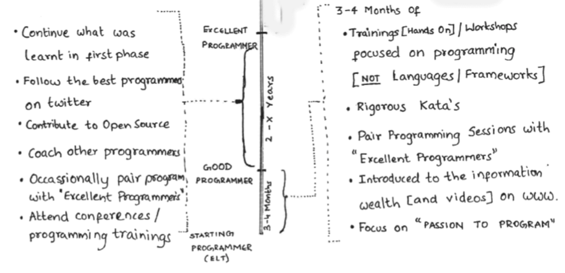

#### What do you think about while you code
- Am I going to understand this in 3 months time?
- Am I trying to be too clever: is there a simpler way to get the job done?
- Can I write this in such a way as to make some parts re-usable?
- Have I written anything before that I could re-use here?
- What's for dinner?
- Am I going to be able to easily test this?
- Is the first programmer who will read the code going to send a snippet to The Daily WTF?

#### Important Things to Learn
- Spring
- Unit Testing
- TDD
- Microservices Architecture

#### Ask Why?
- Question Everything!

#### Books
- Code Complete by Steve McConnell.
- Clean Code- A Handbook of Agile Software Craftsmanship     
- The Pragmatic Programmer: From Journeyman to Master by Andrew Hunt
- Effective Java (2nd Edition) by Joshua Bloch
- Refactoring: Improving the Design of Existing Code by Martin Fowler
- Test Driven Development: By Example by Kent Beck

#### Katas
- Refactoring Examples :http://refactormycode.com/codes/recent/java
- Roman Numerals:http://vimeo.com/33841375
- http://ubuntuforums.org/showthread.php?t=1714324
- http://www.docondev.com/2011/12/roman-numeral-kata.html
- http://www.codingdojo.org/cgi-bin/wiki.pl?KataCatalogue
- http://schuchert.wikispaces.com/Katas
- http://www.butunclebob.com/ArticleS.UncleBob.ThePrimeFactorsKata
- http://sites.google.com/site/tddproblems/all-problems-1
- http://butunclebob.com/ArticleS.UncleBob.TheBowlingGameKata
- http://www.docondev.com/2011/01/sharpening-saw.html
- http://codekata.pragprog.com/2007/01/code_kata_one_s.html
- http://programmingpraxis.com/contents/chron/
- http://www.codinghorror.com/blog/2008/06/the-ultimate-code-kata.html
- http://www.knowing.net/index.php/2006/06/16/15-exercises-to-know-a-programming-language-part-1/
- http://vimeo.com/user3159463/videos/sort:plays
- http://johannesbrodwall.com/2010/04/06/why-tdd-makes-a-lot-of-sense-for-sudoko/
- http://www.viddler.com/explore/GreggPollack/videos/29 LCD Numbers Kata by Corey
- http://osherove.com/tdd-kata-1/
- http://osherove.com/tdd-kata-2/

### Programming FAQ

#### Should I be an expert at all Design Patterns?
- My personal view : Design Patterns are good to know. Have a good idea on what each one of them does. But, that where it ends. I’m not a big fan of understanding the intricate details of each Design Pattern. You can look it up if you have a good overall idea about Design Patterns.
- Full Video on Design Patterns : https://www.youtube.com/watch?v=0jjNjXcYmAU
- Java EE Design Patterns : https://github.com/in28minutes/Java-EE-Design-Patterns/blob/master/JavaEE%20Design%20Patterns%20and%20Architecture%20-%20Presentation%20v0.7.pdf
- Java Design Patterns : https://github.com/in28minutes/Design-Patterns-For-Beginners/blob/master/DesignPatterns-Presentation.pdf

#### What are NFRs?
- Performance
- Scalability
- Maintainability
- Portability
- Availability
- Security 
- Testability etc..

## Coding

### Java Tips

#### Why should you have minimum scope for variables?

#### Why should you understand performance of String Concatenation?

#### What are the best practices with Exception Handling?
- Do not ignore exceptions
- When coding, think what will the guy debugging a problem here would need?
- Microservices - Centralized logging & correlation id

#### When is it recommended to prefer Unchecked Exceptions?
- Spring Framework

#### When do you use a Marker Interface?

#### Why are ENUMS important for Readable Code?

#### Avoid String when other types are appropriate

#### Why should you minimize mutability?

#### What is functional programming?

#### Why should you prefer Builder Pattern to build complex objects?

#### Why should you avoid floats for Calculations?

#### Why should you build the riskiest high priority features first?

### Code Quality

#### Code Quality Overview
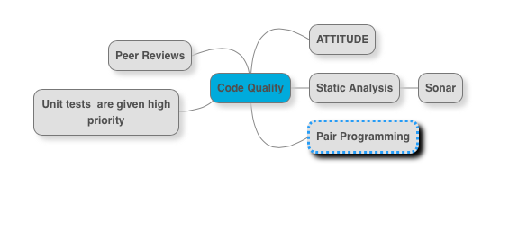
- An overview : https://github.com/in28minutes/java-best-practices/blob/master/pdf/CodeQuality.pdf
- More than everything else, code quality is an attitude. Either, the team has it or not. The attitude to refactor when something is wrong. The attitude to be a boy scout. As an architect, it is important to create an environment where such an attitude is appreciated. (There are always bad sheep, who take the code quality to such depth that it is not fun anymore, but I like them more than developers who keep churning out bad code).
- Have a good static analysis tool(and is part of Continuous Integration). Sonar is the best bet today. Understand the limits of Static Analysis. Static Analysis is not a magic wand. For me, results from Static Analysis are a signal: It helps me decide where I should look during peer or architect reviews?
- Have good peer review practices in place. Every user story has to be peer reviewed. Put more focus on peer reviews when there is a new developer or there is a new technical change being done. Make best use of Pair Programming. The debate is ongoing : Is pair programming more productive or not? I would rather stay out of it. You make your choice. However,  these two scenarios are bare minimum:
 - Onboarding a new programmer. Makes him comfortable with all the new things he has to encounter.
 - Implementing a complex functionality.
- Next question is how to approach a Code Review. Difficult to cover everything. I would make a start. When doing a code review, I start with static analysis results (for example, sonar). I spend 10 minutes getting an overview of components and/or layers (focusing on size and dependencies). Next I would pick up a unit test for a complex functionality. I feel unit tests are the best place to discover the dependencies and naming practices (I believe good names = 50% of maintainable code). If a programmer can write a simple and understandable unit test, he can definitely write good code. Next, I look for 4 principles of Simple Design. After this, there are 100 other things we can look for - You decide.

#### Why should you not take code quality tools at face value?
- If a project has a great Sonar report, does it mean it is perfect? 
- Nope, code quality tools are just a guidance!
- Your focus should be to write code that adheres to "4 Principles of Simple Design"
- Peer Reviews are necessary!

#### Why should you have coding standards?

#### What are the most important coding standards?
- Complexity of a method
- Naming variables, methods and classes
- Size of methods and classes
- Number of parameters

#### What is Pair Programming?

#### Why is readable code important?

#### Static Code Analysis
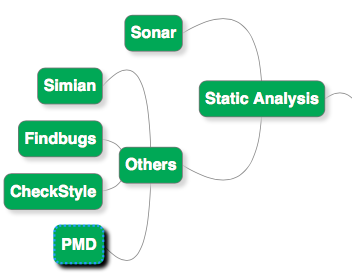

#### SONAR
- One Slide from PDF - Making use of SONAR 
- https://github.com/in28minutes/java-best-practices/blob/master/pdf/CodeQuality.pdf

#### Code Reviews
- PDF : https://github.com/in28minutes/java-best-practices/blob/master/pdf/CodeReview-BestPractices.pdf

## Modern Development Practices
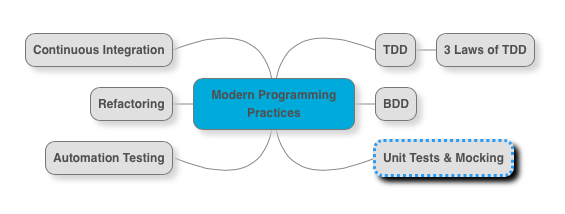
- Unit Testing and Mocking : We are in the age of continuous integration and delivery, and the basic thing that enables those is having a good set of unit test in place. (Don’t confuse unit testing with screen testing done manually to check if the screen flow is right. What I mean by unit testing is JUnit test’s checking the business logic/screen flow in a java method (or) set of methods). Understand JUnit. Here is a good start : https://courses.in28minutes.com/p/junit-tutorial-for-beginners. Also understand the concept of Mocking. When should we mock? And when we should not? Complicated question indeed.  Understand one mocking framework : Mockito is the most popular one. Easymock is a good mocking framework as well.
- Automated Integration Tests. Automated Integration Tests is the second important bullet in enabling continuous delivery. Understand Fitnesse, Cucumber and Protractor.
- TDD (actually I wanted to put it first). Understand what TDD is. If you have never used TDD, then be ready for a rude shock.  Its not easy to change a routine you developed during decades (or years) of programming. Once you are used to TDD you never go back. I promise. This list of videos is a good start to understanding TDD. https://www.youtube.com/watch?v=xubiP8WoT4E&list=PLBD6D61C0A9F671F6. Have fun.
- BDD. In my experience, I found BDD a great tool to enable communication between the ready team (Business Analysts, Product Owner) and the done team (Developers, Testers, Operations). When User Stories are nothing but a set of scenarios specified is GWT (Given When Then) format, it is easy for the done team to chew at the user story scenario by scenario.  With tools like Cucumber & Fitnesse, tooling is not far behind too. Do check BDD out.
- Refactoring. Is there an Architect who does not encounter bad code? Understand refactoring. Understand the role of automation tests in refactoring.
- Continuous Integration. Every project today has continuous integration. But, the real question is “What is under Continuous Integration?”. Compilation, unit tests and code quality gate(s) is the bare minimum. If you have integration and chain tests, wonderful. But make sure the build does not take long. Immediate feedback is important. If needed, create a separate build scheduled less frequently for slower tests (integration and chain tests). Jenkins is the most popular Continuous Integration tool today.
[[ModernDevelopmentPractices.png]]

### Unit Testing

#### Unit Testing Best Practices
[Unit Testing Best Practices](pdf/UnitTestingBestPractices.pdf)

#### Why is unit testing important?

#### Why is performance of Unit Tests important?

#### Do not be fooled by Code Coverage!

#### Why should a good programmer understand Mocking?

### What is TDD?

#### Why should you write unit tests with/before code?

### What is BDD?

### What is ATDD?

#### When should you have multiple CI builds?

### Continuous Integration

#### Continuous Integration - Important Questions
- How often is code commited?
- How early are problems/defects found/fixed?
 - Code Quality, Code Review, ST Defects 
- Broken Builds?
- How often is code deployed to production?
- How often is code deployed to test environment?
- How different is deploying code to local or test environment from deploying code to production? 
- What steps are in continuous integration? More steps in continuous integration means more stability.
 - Compilation
 - Unit Tests
 - Code Quality Gates
 - Integration Tests
 - Deployment
 - Chain Tests
- How long does a Continuous Integration build run for? Is there a need for multiple builds?

### DevOps
- Typically Enterprise Teams are made up of number of teams - Dev, QA, DBA,Administrators, Operations, Project and Release Management. 
- Each team works in silos. Some teams have contradicting goals. Dev team wants to push their features live as soon as possible where as Operations want stability. Operations are measured on availability. 
- Reliance on documentation and hand-offs. 
- Devops aims at making these teams work together focused on single goal - Delivering value to end customers safely. 
- Single Leadership. 
- Continuous Delivery. 

## Design

### Agile and Design
[Design in Agile Projects](pdf/AgileAndDesign-Evolution.pdf)

#### Evolutionary Design

### What are the 4 Principles of Simple Design?

### Design Focus Areas
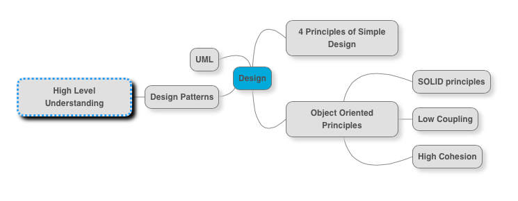
- 4 Principles of Simple Design. https://www.youtube.com/watch?v=OwS8ydVTx1c&list=PL066F8F24976D837C
 - Runs all tests
 - Minimize Duplication
 - Maximize Clarity
 - Keep it Small
 - Code - Method, Class, jar etc
 - Component
 - Cycle Time (Short cycles)
 - Team Size
 
- Object Oriented Programming. Have good object, which have well-defined responsibilities.  Following are the important concepts you need to have a good overview of. These are covered in various parts in the video https://www.youtube.com/watch?v=0xcgzUdTO5M. Also, look up the specific videos for each topic.
 - Coupling :
 - Cohesion : https://www.youtube.com/watch?v=BkcQWoF5124&list=PLBBog2r6uMCTJ5JLyOySaOTrYdpWq48vK&index=9
 - Encapsulation
 - Polymorphism : https://www.youtube.com/watch?v=t8PTatUXtpI&list=PL91AF2D4024AA59AF&index=5
 - SOLID Principles : https://github.com/in28minutes/java-best-practices/blob/master/pdf/SOLIDPrinciples.pdf
- UML is next even though, formal use of UML is on the way down with Agile. However, I think UML is a great tool in the arsenal for a white board discussion on design. A picture is worth thousand words. I recommend having a good overview of the UML basics. Focus on these four before you move on to others.
 - Class diagrams
 - Sequence diagrams
 - Component diagrams
 - Deployment diagrams
- Design Patterns. Following video covers all the major design patterns. https://www.youtube.com/watch?v=0jjNjXcYmAU. My personal view : Design Patterns are good to know. Have a good idea on what each one of them does. But, that where it ends. I’m not a big fan of understanding the intricate details of each Design Pattern. You can look it up if you have a good overall idea about Design Patterns.
https://github.com/in28minutes/java-best-practices/blob/master/pdf/DesignPatternsForBeginners.pdf
https://github.com/in28minutes/java-best-practices/blob/master/pdf/J2EE(Java%20EE)%20Design%20Patterns%20and%20Architecture.pdf

### Design Review
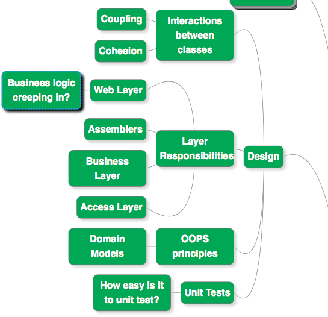

## Architecture
Details about the important parts of the systems and the constraints (boundaries, communication, standards, guidelines)

## How to be a good architect?
- PDF - How to be a good architect : https://github.com/in28minutes/java-best-practices/blob/master/pdf/How%20to%20be%20a%20good%20Software%20Architect.pdf

### Architect Responsibilities
- Having good governance in place. Good review processes in place for Architecture, Design and Code.
- Creating a clean architecture based on sound principles. Architecture covering all Non Functional Requirements.
- Ensuring teams are as productive as they can be. Right tools.
- Ensuring teams are following the best engineering practices.
- Ensuring clear communication about architecture with business and technical teams.
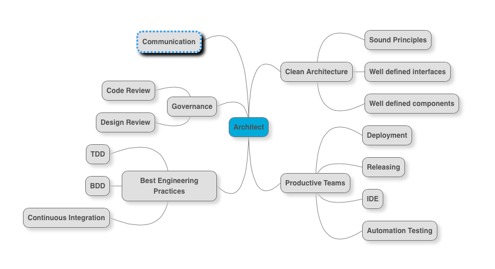

### Architect Qualities
Most important qualities I look for in an Architect are
- Impeccable Credibility : Somebody the team looks up to and aspires to be.
- Super diagnostic skills : The ability to do a deep dive on a technology issue. When developers are struggling with a problem (having tried different things),  Can he/she provide a fresh pair of eyes to look at the same problem?
- Forward Thinker and Proactive : Never satisfied with where we are. Identifies opportunities to add value fast.
- Great Communication :  Communication in the widest sense. Communicating the technical aspects to the stakeholders, project management, software developers, testers, etc.
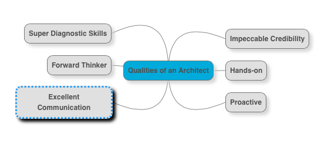

### Architecture Review
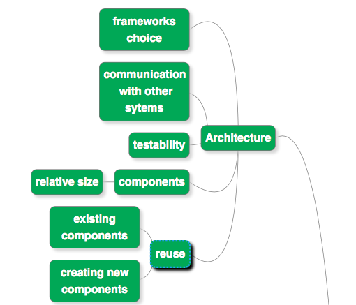

### General 

#### Why is it important to use Continuous Integration from Day 0 of the project?

#### What is a vertical slice? Why should you need it?

#### Why should you create a reference component?

#### Agile and Architecture. Do they go together?
- First of all I’m a great believer that agile and architecture go hand in hand. I do not believe agile means no architecture. I think agile brings in the need to separate architecture and design. For me architecture is about things which are difficult to change : technology choices, framework choices, communication between systems etc. It would be great if a big chunk of architectural decisions are made before the done team starts. There would always be things which are uncertain. Inputs to these can come from spikes that are done as part of the Done Scrum Team.But these should be planned ahead.
- Architecture choices should be well thought out. Its good to spend some time to think (Sprint Zero) before you make a architectural choice.
- I think most important part of Agile Architecture is Automation Testing. Change is continuous only when the team is sure nothing is broken. And automation test suites play a great role in providing immediate feedback.
- Important principles for me are test early, fail fast and automate.

### Layers
- PDF https://github.com/in28minutes/java-best-practices/blob/master/pdf/LayeringInJavaApplications.pdf

#### Business Layer
Listed below are some of the important considerations
- Should I have a Service layer acting as a facade to the Business Layer?
- How do I implement Transaction Management? JTA or Spring based Transactions or Container Managed Transactions? What would mark the boundary of transactions. Would it be service facade method call?
- Can (Should) I separate any of the Business Logic into seperate component or service?
- Do I use a Domain Object Model?
- Do I need caching? If so, at what level?
- Does service layer need to handle all exceptions? Or shall we leave it to the web layer?
- Are there any Operations specific logging or auditing that is needed?Can we implement it as a cross cutting concern using AOP?
- Do we need to validate the data that is coming into the Business Layer? Or is the validation done by the web layer sufficient?

#### Data Layer
- Do we want to use a JPA based object mapping framework (Hibernate) or query based mapping framework (iBatis) or simple Spring DO?
- How do we communicate with external systems? Web services or JMS? If web services, then how do we handle object xml mapping? JAXB or XMLBeans?
- How do you handle connections to Database? These days, its an easy answer : leave it to the application server configuration of Data Source.
- What are the kinos of exceptions that you want to throw to Business Layer? Should they be checked exceptions or unchecked exceptions?
- Ensure that Performance and Scalability is taken care of in all the decisions you make.

#### Web Layer
- First question is do we want to use a modern front end javascript framework like AngularJS? If the answer is yes, most of this discussion does not apply. If the answer is no, then proceed?
- Should we use a MVC framework like Spring MVC,Struts or should we go for a Java based framework like Wicket or Vaadin?
- What should be the view technology?  JSP, JSF or Template Based (Velocity, Freemarker)?
- Do you want AJAX functionality?
- How do you map view objects to business objects and vice-versa? Do you want to have View Assemblers and Business Assemblers?
- What kind of data is allowed to be put in user session? Do we need additional control mechanisms to ensure session size is small as possible?
- How do we Authenticate and Authorize users? Do we need to integrated external frameworks like Spring Security?
- Do we need to expose external web services?

### Web Services

- Service Provider : Google.com is the service provider. Handles the request and sends a response back.
- Service Consumer : Browser is the service consumer. Creates Request. Invokes Service. Processes the Response.
- Data Exchange Format : In this example, Data Exchange is done over HTTP protocol. Request is HTTP request and Response is HTTP Response. Data exchange format can be something else as well. SOAP (in case of SOAP web services) and JSON (most RESTful services).

#### Advantages
- Re-use : Web services avoid the need to implement business logic repeatedly. If we expose a web service, other applications can re-use the functionality
- Modularity : For example, tax calculation can be implemented as a service and all the applications that need this feature can invoke the tax calculation web service. Leads to very modular application architecture.
- Language Neutral : Web services enable communication between systems using different programming languages and different architectures. For example, following systems can talk with each other : Java, .Net, Mainframes etc.
- Web Services are the fundamental blocks of implementing Service Oriented Architecture in an organization.

#### SOAP Web Services

- In SOAP web services, data exchange (request and responses) happens using SOAP format. SOAP is based on XML.
- SOAP format defines a SOAP-Envelope which envelopes the entire document. SOAP-Header (optional) contains any information needed to identify the request. Also, part of the Header is authentication, authorization information (signatures, encrypted information etc). SOAP-Body contains the real xml content of request or response.
- All the SOAP web services use this format for exchanging requests and responses. In case of error response, server responds back with SOAP-Fault.

##### WSDL
WSDL defines the format for a SOAP Message exchange between the Server (Service Provider) and the Client (Service Consumer).

A WSDL defines the following:
- What are the different services (operations) exposed by the server?
- How can a service (operation) be called? What url to use? (also called End Point).
- What should the structure of request xml?
- What should be the structure of response xml?

##### Marshalling and Unmarshalling

SOAP web services use SOAP based XML format for communication. Java applications work with beans i.e. java objects. For an application to expose or consume SOAP web services, we need two things
- Convert Java object to SOAP xml. This is called Marshalling.
- Convert SOAP xml to Java object. This is called Unmarshalling.
JAXB and XMLBeans are frameworks which enable use to do marshalling and unmarshalling easily.

##### Security
- At transport level, SSL is used to exchange certificates (HTTPS). This ensures that the server (service producer) and client (service consumer) are mutually authenticated. It is possible to use one way SSL authentication as well.
- At the application level, security is implemented by transferring encrypted information (digital signatures, for example) in the message header (SOAP Header). This helps the server to authenticate the client and be confident that the message has not been tampered with.

#### REST Web Services
- PDF TO UPDATE https://www.mindmup.com/#m:g10B8KENIDghuHAYmFzM0daOU80SDA
- There are a set of architectural constraints (we will discuss them shortly) called Rest Style Constraints. Any service which satisfies these constraints is called RESTful Web Service.
- There are a lot of misconceptions about REST Web Services : They are over HTTP , based on JSON etc. Yes : More than 90% of RESTful Web Services are JSON over HTTP. But these are not necessary constraints. We can have RESTful Web Services which are not using JSON and which are not over HTTP.

##### Constraints
The five important constraints for RESTful Web Service are
- Client - Server : There should be a service producer and a service consumer.
- The interface (URL) is uniform and exposing resources. Interface uses nouns (not actions)
- The service is stateless. Even if the service is called 10 times, the result must be the same.
- The service result should be Cacheable. HTTP cache, for example.
- Service should assume a Layered architecture. Client should not assume direct connection to server - it might be getting info from a middle layer - cache.

##### Richardson Maturity Model
Richardson Maturity Model defines the maturity level of a Restful Web Service. Following are the different levels and their characteristics.
- Level 0 : Expose SOAP web services in REST style. Expose action based services (http://server/getPosts, http://server/deletePosts, http://server/doThis, http://server/doThat etc) using REST.
- Level 1 : Expose Resources with proper URI’s (using nouns). Ex: http://server/accounts, http://server/accounts/10. However, HTTP Methods are not used.
- Level 2 : Resources use proper URI's + HTTP Methods. For example, to update an account, you do a PUT to . The create an account, you do a POST to . Uri’s look like posts/1/comments/5 and accounts/1/friends/1.
- Level 3 : HATEOAS (Hypermedia as the engine of application state). You will tell not only about the information being requested but also about the next possible actions that the service consumer can do. When requesting information about a facebook user, a REST service can return user details along with information about how to get his recent posts, how to get his recent comments and how to retrieve his friend’s list.

##### RESTful API Best Practices
- Needs more work
- While designing any API, the most important thing is to think about the api consumer i.e. the client who is going to use the service. What are his needs? Does the service uri make sense to him? Does the request, response format make sense to him?
- URI’s should be hierarchical and as self descriptive as possible. Prefer plurals.
- Always use HTTP Methods. Best practices with respect to each HTTP method is described below:
 - GET : Should not update anything. Should be idempotent (same result in multiple calls). Possible Return Codes 200 (OK) + 404 (NOT FOUND) +400 (BAD REQUEST)
 - POST : Should create new resource. Ideally return JSON with link to newly created resource. Same return codes as get possible. In addition : Return code 201 (CREATED) is possible.
 - PUT : Update a known resource. ex: update client details. Possible Return Codes : 200(OK)
 - DELETE : Used to delete a resource.

##### JAX-RS
JAX-RS is the JEE Specification for Restful web services implemented by all JEE compliant web servers (and application servers).
Important Annotations
- @ApplicationPath("/"). @Path("users") : used on class and methods to define the url path.
- @GET @POST : Used to define the HTTP method that invokes the method.
- @Produces(MediaType.APPLICATION_JSON) : Defines the output format of Restful service.
- @Path("/{id}") on method (and) @PathParam("id") on method parameter : This helps in defining a dynamic parameter in Rest URL. @Path("{user_id}/followers/{follower_id}") is a more complicated example.
- @QueryParam("page") : To define a method parameter ex: /users?page=10.

Useful methods:
- Response.OK(jsonBuilder.build()).build() returns json response with status code.
- Json.createObjectBuilder(). add("id",user.getId()); creates a user object.

##### How should you document your REST Web Services?
- Swagger is the popular option
- Restdocs is popular too

### Microservices Architecture
http://eugenedvorkin.com/wp-content/uploads/2014/06/micro-service-architecture.png
- Challenges with Monolith Applications - Longer Release Cycles because of Large Size, Large Teams and difficulty in adopting Automation testing and modern development practices
- “Keep it Small”. Small deployable components.
- Flights
 - Points
 - Offers
 - Trips
- Customer
 - Product
 - Order
 - Recommendations
- Key question to ask : Can we make a change to a service and deploy it by itself without changing anything else?

#### Microservices Characteristics
- Small, Lightweight
- Loosely coupled service-oriented architectures with bounded contexts
- Bounded Scope, Limited Scope, Solve one problem well
- Interoperable with message based communication
- Independently deployable and testable services
- Building systems that are replaceable over being maintainable
- “Smart endpoints and dump pipes”

#### Advantages
- Faster Time To Market
- Complete Automation Possibility
- Experimentation
- Technology Evolution
- Speed of innovation
- Team Autonomy : Enables creation of independent teams with End-to-End ownership
- Deployment Simplicity
- Flexible Scaling

#### Challenges
- Visibility
- Standardization
- Operations Team
- Determining Boundaries

#### What is the difference between Microservices and SOA?
Microservices have similar goals from SOA : Create services around your business logic.

Key Differences
- Big vendors hijacked SOA to link SOA with products like Enterprise Services Bus (Websphere ESB, Oracle ESB, TIBCO Business Works) etc
- SOA was tied to XML and its formalities and complexities
- SOA had centralized governance whereas microservice architecture recommends a decentralized governance.
- SOA did not focus on the independent deployability of the components.
- ESB was brought in to enable loose coupling for SOA based systems. The complexity with the ESBs etc in SOA lead to coining the term “dumb pipes smart endpoints”
Example:
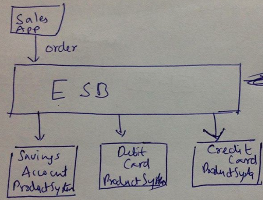
- Consider a banking application selling multiple products
- Along with Saving Account, a customer gets a Debit Card Free and a Insurance
Saving Account and Debit Card are different products managed by different product systems
- In SOA Architecture, the ESB took the order request from the sales application and handled the communication with creating the appropriate products. ESB ends up having a lot of logic. Heavy weight ESB. 
- Microservices use more of an event driven architecture!

#### What are Cloud Native Applications?
- 12 Factor App
- Codebase - One codebase tracked in revision control, many deploys
- Dependencies - Explicitly declare and isolate dependencies
- Config - Store config in the environment
- Backing services - Treat backing services as attached resources
- Build, release, run - Strictly separate build and run stages
- Processes - Execute the app as one or more stateless processes
- Port binding - Export services via port binding
- Concurrency - Scale out via the process model
- Disposability - Maximize robustness with fast startup and graceful shutdown
- Dev/prod parity - Keep development, staging, and production as similar as possible
- Logs - Treat logs as event streams
- Admin processes - Run admin/management tasks as one-off processes

#### Why is it important to have an API Standard?
- YARAS

#### What is the importance of Logging and Centralized Monitoring?

#### Automate! Automate! Automate!
- Why is it important? 
- Personal Experience with Deployment Automation, Providing user screen with requests/responses

### Component Based Architecture

#### Why should you create small components?

## Tools

### Maven

#### What happens behind Maven? What is a Repository?

#### What is use of Maven Parent POM?

#### Maven Best Practices 

#### 10 Tips For Maven
[10 Tips for Eclipse and Maven](pdf/10TipsforEclipseAndMaven.pdf)

### Why should you have api & impl in each layer maven projects?

### IDE - Eclipse
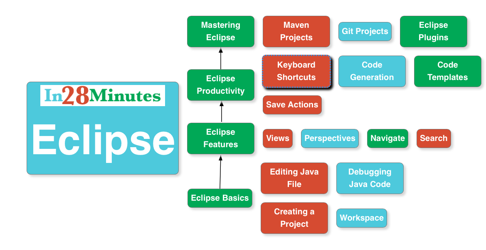

#### 10 Tips For Eclipse
[10 Tips for Eclipse and Maven](pdf/10TipsforEclipseAndMaven.pdf)

### Version Control

#### Why should you migrate to GIT?

#### Why should you commit your code often? 

#### What are version control best practices
- Do not commit derived files.
- Do not commit IDE files.
- Commit often
- Use Git

## Frameworks

## Performance

### Good Practices
- First and Foremost - NO premature optimizations. Any optimization decision should be based on numbers or past experience. In Donald Knuth's paper "Structured Programming With GoTo Statements", he wrote: "Programmers waste enormous amounts of time thinking about, or worrying about, the speed of non critical parts of their programs, and these attempts at efficiency actually have a strong negative impact when debugging and maintenance are considered. We should forget about small efficiencies, say about 97% of the time: premature optimization is the root of all evil. Yet we should not pass up our opportunities in that critical 3%."
- Session size - Small
- Implement Caching whereever possible
- Set initial size on Collections
- Create necessary Indexes on Database. Collect Statistics and Remove unnecessary data
- In critical parts - write unit tests for performance.
- Be conscious about create as few objects as possible. Especially in loops.
- Avoid String Concatenation
- Eliminate Obselete Object References
- Close connections and Streams
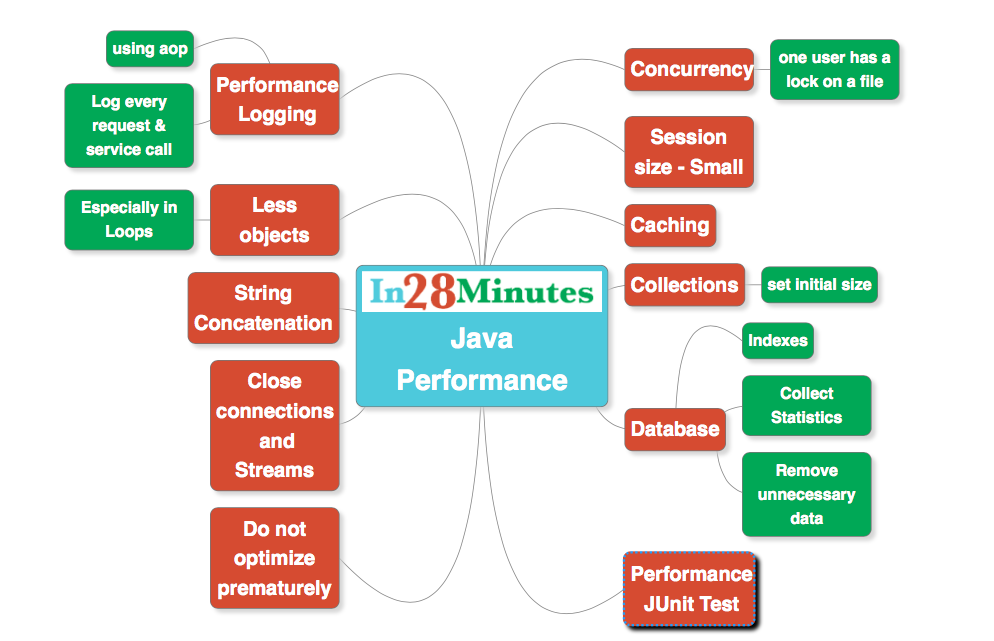

### Why do Stateless applications perform better?

### Why should you optimize judiciously?

### How can you increase performance and reliability of applications using Queues?

### Distributed Cache
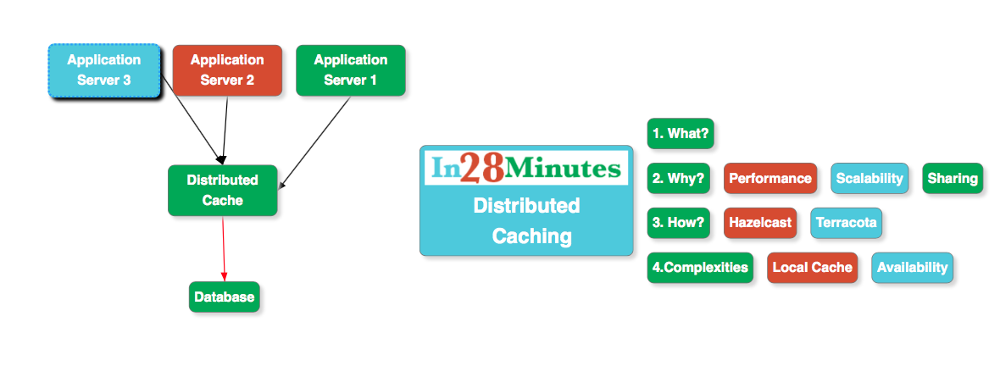

### Load and Performance Testing
- PDF Presentation https://github.com/in28minutes/java-best-practices/blob/master/pdf/LoadAndPerformanceTestingBestPractices.pdf
- Have clear performance objectives. That’s the single most important objective. Decide Peak Load, Expected Response Time, Availability Required before hand.
- Establish clear performance expectations with the Interface Services
- An application does not work on its own. It connects with a number of external interfaces. Establish clear performance expectations with the Interface Services
- The next important thing is to ensure that you mirror your production environment. A load testing environment should be the same as your production environment. We will discuss the exact factors involved later in this article.
- Validate early : Do performance testing as early as possible.
- Make it a regular practice to use profilers in development environment. ex:JProfiler
- Make sure team is not making premature optimizations. Any optimization decision should be based on numbers or past experience. In Donald Knuth's paper "Structured Programming With GoTo Statements", he wrote: "Programmers waste enormous amounts of time thinking about, or worrying about, the speed of non critical parts of their programs, and these attempts at efficiency actually have a strong negative impact when debugging and maintenance are considered. We should forget about small efficiencies, say about 97% of the time: premature optimization is the root of all evil. Yet we should not pass up our opportunities in that critical 3%."
- Have Clear Strategy on How to Handle expected load. What would be the initial settings on the application server? Do you plan to use a clustered environment? Do you need a load balancer?

## Security
Hmmm... Should I really explain the importance of Security?
Presentation : https://github.com/in28minutes/java-best-practices/blob/master/pdf/SecuringYourApplication-OWASP.pdf

## Indian IT
### How to create Good Programmers?

## Campus Interview Guide
- https://docs.google.com/document/d/1IP6HNgpMdCAAJEREowfBj2XPLBrPcIIFNIGFPGX0-ao/edit#heading=h.byb5dl2v0c4p

### Other Courses
- More Courses and Videos From in28Minutes - https://github.com/in28minutes/learn

## Compare and Contrast
- Spring MVC vs Struts
- Mockito vs EasyMock
- Mockito vs JUnit
- Microservices vs SOA
- GIT vs SVN

## Images
- Queue : https://upload.wikimedia.org/wikipedia/commons/thumb/9/9d/The-amqp-model-for-wikipedia.svg/1024px-The-amqp-model-for-wikipedia.svg.png
- Different Kinds of Testing : https://upload.wikimedia.org/wikipedia/commons/8/80/Agile_DevOps_Shift_Left_Testing.jpg
- Continuous Delivery : https://upload.wikimedia.org/wikipedia/commons/thumb/c/c3/Continuous_Delivery_process_diagram.svg/1280px-Continuous_Delivery_process_diagram.svg.png
- Devops : https://upload.wikimedia.org/wikipedia/commons/thumb/0/05/Devops-toolchain.svg/2000px-Devops-toolchain.svg.png
- Devops2 : https://upload.wikimedia.org/wikipedia/commons/thumb/b/b5/Devops.svg/1079px-Devops.svg.png

### Troubleshooting
- Refer our TroubleShooting Guide - https://github.com/in28minutes/in28minutes-initiatives/tree/master/The-in28Minutes-TroubleshootingGuide-And-FAQ

## Youtube Playlists - 500+ Videos

[Click here - 30+ Playlists with 500+ Videos on Spring, Spring Boot, REST, Microservices and the Cloud](https://www.youtube.com/user/rithustutorials/playlists?view=1&sort=lad&flow=list)

## Keep Learning in28Minutes

in28Minutes is creating amazing solutions for you to learn Spring Boot, Full Stack and the Cloud - Docker, Kubernetes, AWS, React, Angular etc. - [Check out all our courses here](https://github.com/in28minutes/learn)
